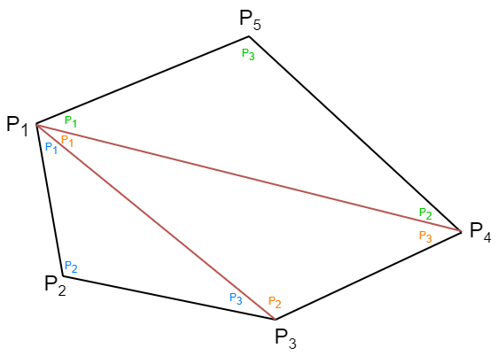

# obj2stl

## Usage

obj2stl data/teapot.obj 1,0,0;0,1,0;0,0,1

- The transformation matrix is optional. Do not put spaces between the numbers and punctuations.
- The STL file will be placed next to the OBJ.

## Architecture Pipeline

1. Parsing OBJ into internal representation
2. Transformation <br>
   * User defined
   * Translate modell to Octant I.
3. Triangulation
4. Vertex Sorting
5. Saving STL

## 1. OBJ File Format

### Language elements

| Element | Indicator | Mandatory  | Optional | Type | 
|---|---|---|---|---|
|  geometric vertices | v | x y z | w (= 1.)  | float |
|  texture vertices | vt | u v | w (= 1.) | float |
|  vertex normals | vn | i j k |   | float |
|  faces | f | v<sub>1</sub>/vt<sub>1</sub>/vn<sub>1</sub> ... v<sub>n</sub>/vt<sub>m</sub>/vn<sub>l</sub> |   | int |

Notes:
- Order of lines does not really matter, obviously referred lines should come prior
- Relative vertices are referred with negative indices: <br>
```v 0.000000 2.000000 2.000000``` <br>
```v 0.000000 0.000000 2.000000``` <br>
```v 2.000000 0.000000 2.000000``` <br>
```v 2.000000 2.000000 2.000000``` <br>
```f -4 -3 -2 -1```

## 2. Transformation

**"The all positive octant rule says that the coordinates of the triangle vertices must all be positive."**

1. User defined affine transformation is allowed to feed into the transformer modul.
2. Have to translate the whole model to the first octant. This can be achived by calculating the enclosing box of the whole model, then we just translate its vertex containing the lowest coordinates into to origo. Because every coordinate is bigger than the lowest one, then we can guarantee that the model will have no negative coordinate.

The actual transformation is the compositon of all the transformation matrices in order as mentioned above, so that we do the transformation only once for the vertices.

## 3. Triangulation

**"The vertex rule states that each triangle must share two vertices with its neighboring triangles."**

OBJ file format does not guarantee that all the faces are triangles. Because we can assume that the faces are convex and planar, then we apply the following steps to split the face into triangles.



## 4. Vertex Sorting

**"The triangle sorting rule recommends that the triangles appear in ascending z-value order."**

This helps Slicers slice the 3D models faster. However, this rule is not strictly enforced.

## 5. Binary STL File Format 

```
UINT8[80] # Header
UINT32    # Number of triangles

# foreach triangle
REAL32[3] # Normal vector
REAL32[3] # Vertex 1
REAL32[3] # Vertex 2
REAL32[3] # Vertex 3
UINT16    # Attribute byte count (ususally all zeros)
```
